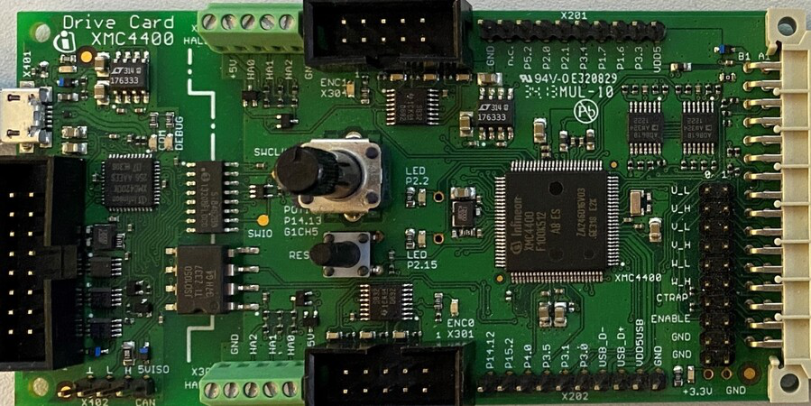

# KIT_XMC4400_DC_V1 BSP

## Overview

The XMC4400 Drive Card houses the XMC4400 Microcontroller, a power board connector, two sets of position interface circuits with hall and encoder connectors, a multi feedback interface and an isolated on-board debug interface with CAN capability. The board along with a three phase inverter demonstrates the capabilities of the XMC4400. The main use case for this board is to demonstrate the motor control features of XMC4400 device including tool chain. The focus is safe operation under evaluation conditions. The board is neither cost nor size optimized and does not serve as a reference design.     
**Note:**
Programming this kit requires installing 
[SEGGER J-Link software](https://www.segger.com/downloads/jlink/#J-LinkSoftwareAndDocumentationPack)

To use code from the BSP, simply include a reference to `cybsp.h`.

## Features

### Kit Features:

* XMC4400 Microcontroller in LQFP-100 with 512KB Flash and full peripheral set of XMC4400 series
* On board Debugger for downloading and debugging of application code
* Virtual COM port for UART communication with terminal program e.g. Hyperterminal

### Kit Contents:

* KIT_XMC4400_DC_V1 drive card

## BSP Configuration

The BSP has a few hooks that allow its behavior to be configured. Some of these items are enabled by default while others must be explicitly enabled. Items enabled by default are specified in the KIT_XMC4400_DC_V1.mk file. The items that are enabled can be changed by creating a custom BSP or by editing the application makefile.

Components:
* Device specific category reference (e.g.: CAT1) - This component, enabled by default, pulls in any device specific code for this board.

Defines:
* CYBSP_WIFI_CAPABLE - This define, disabled by default, causes the BSP to initialize the interface to an onboard wireless chip if it has one.
* CY_USING_HAL - This define, enabled by default, specifies that the HAL is intended to be used by the application. This will cause the BSP to include the applicable header file and to initialize the system level drivers.
* CYBSP_CUSTOM_SYSCLK_PM_CALLBACK - This define, disabled by default, causes the BSP to skip registering its default SysClk Power Management callback, if any, and instead to invoke the application-defined function `cybsp_register_custom_sysclk_pm_callback` to register an application-specific callback.

See the [BSP Setttings][settings] for additional board specific configuration settings.

## API Reference Manual

The KIT_XMC4400_DC_V1 Board Support Package provides a set of APIs to configure, initialize and use the board resources.

See the [BSP API Reference Manual][api] for the complete list of the provided interfaces.

## More information
* [KIT_XMC4400_DC_V1 BSP API Reference Manual][api]
* [KIT_XMC4400_DC_V1 Documentation](https://www.infineon.com/cms/en/product/evaluation-boards/kit_xmc4400_dc_v1/)
* [Cypress Semiconductor, an Infineon Technologies Company](http://www.cypress.com)
* [Infineon GitHub](https://github.com/infineon)
* [ModusToolbox™](https://www.cypress.com/products/modustoolbox-software-environment)

[api]: https://infineon.github.io/TARGET_KIT_XMC4400_DC_V1/html/modules.html
[settings]: https://infineon.github.io/TARGET_KIT_XMC4400_DC_V1/html/md_bsp_settings.html

---
© Cypress Semiconductor Corporation (an Infineon company) or an affiliate of Cypress Semiconductor Corporation, 2019-2024.